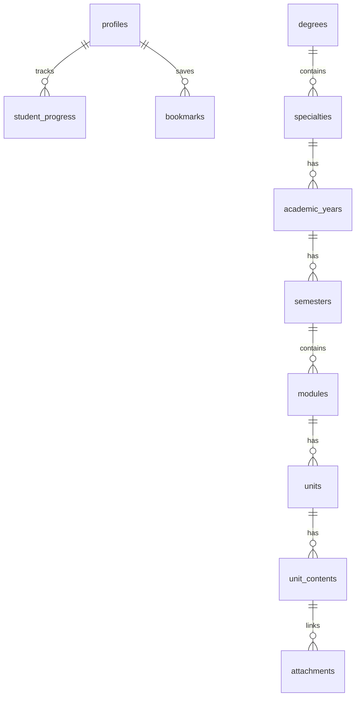

# ADR: Database Design & Supabase Integration Strategy

## Status
Proposed

## Context
The Manhaj Islamic Studies platform requires a robust, scalable, and secure database to manage academic content, student progress, and administrative workflows. The platform is built with React and Tailwind CSS, following the LMD (Licence-Master-Doctorate) system used in Algerian universities.

## Decision

### 1. Auth Strategy
- **Provider**: Supabase Auth.
- **User Linking**: Use `auth.users` for authentication and a `public.profiles` table for application-specific user data.
- **Roles**: `admin`, `editor`, `student`.
- **Role Management**: Store roles in `public.profiles.role`. This allows for easy querying and management within the application schema while keeping auth logic simple.
- **Access Control**: Role-based access control (RBAC) implemented via Row Level Security (RLS) policies.

### 2. Database Schema (PostgreSQL)
We will use a normalized schema to ensure data integrity and flexibility.

#### Core Tables:
- **profiles**: User profiles linked to `auth.users`.
- **degrees**: 'licence', 'master', 'doctorate'.
- **specialties**: Academic specializations (e.g., Fiqh, Hadith).
- **academic_years**: L1, L2, L3, M1, M2.
- **semesters**: S1 to S6.
- **modules**: Courses/Subjects (e.g., Prophetic Biography).
- **units**: Lectures/Topics within a module.
- **unit_contents**: Specific materials (PDF, Video, Reading).

#### Content & Progress:
- **module_content**: Versioned summaries and detailed content.
- **attachments**: Metadata for files stored in Supabase Storage.
- **student_progress**: Tracks completion of units and contents.
- **bookmarks**: Allows students to save specific modules or units.

### 3. Security (RLS)
- **Default**: Enable RLS on all tables.
- **Public Access**: Read-only access for published academic structure and content.
- **Editor Access**: Permission to create/update academic content.
- **Admin Access**: Full control over all tables and user roles.
- **Student Access**: Private read/write for their own progress and bookmarks.

### 4. Storage Strategy
- **Buckets**:
  - `attachments`: For lecture notes, PDFs, and images.
  - `avatars`: For user profile pictures.
- **Security**: Storage policies will mirror RLS logic (e.g., only authenticated users can download attachments; only editors can upload).

### 5. Internationalization (i18n)
- **Approach**: Store Arabic and English content in separate columns (e.g., `name_ar`, `name_en`) to simplify querying and ensure RTL-first support.

## Consequences
- **Pros**:
  - Strong data integrity through foreign key constraints.
  - Secure by default with RLS.
  - Scalable for multi-tenant (organizations) if needed in the future.
  - Aligned with existing TypeScript types.
- **Cons**:
  - Requires careful migration management.
  - Slightly more complex queries due to normalization (mitigated by Supabase's PostgREST).

## Schema Diagram (Conceptual)

